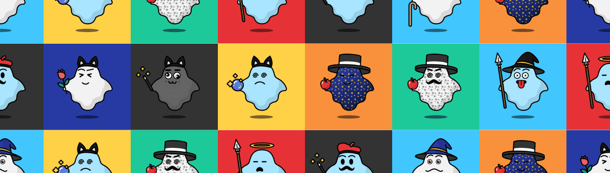

# Codewranglrz: Boos!

嘘！是 Codewranglrz（CodeCast 的一个探索性项目）生成的 10,000 个 NFT 的[集合](https://opensea.io/collection/codecast.io)。我们将 Web3 教育作为我们项目中的一种实用程序结合起来，因为 NFT 持有者将拥有对我们[Discord](https://discord.gg/DF3BXm45eP)频道的独家访问权，他们将在其中接收与 Web3 相关的独家教育内容——从构建 NFT 收藏到 DApp 的所有内容。所以请务必在购买后加入我们的 Discord！

嘘！是 Polygon 区块链上的 NFT 集合。我们之所以选择 Polygon，是因为我们喜欢权益证明机制，并且我们希望普通用户可以访问我们的 NFT。

Codewranglrz 的目标是学习和探索 Web3 的世界。我们用它来建立一个集合，我们将与我们的持有者分享我们的教育内容。

