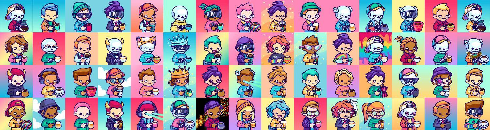

# The Coffee Junkies

Coffee Junkies NFT 在过去 7 天内售出 5 次。The Coffee Junkies 的总销售额为 91.12 美元。The Coffee Junkies NFT 的平均价格为 18.2 美元。有 2,502 名 The Coffee Junkies 所有者，总共拥有 5,779 个代币。

在这个技术让我们感到更加孤立的世界里，我们决定创建一个专注于社区的项目。我们都同意，一杯好咖啡非常接近一个美好的拥抱。因此，这是我们与 6,000 名独特冲泡咖啡爱好者的拥抱。

The Coffee Junkies NFT - 常见问题（FAQ）
▶ 什么是咖啡迷？
Coffee Junkies 是一个 NFT（非同质代币）集合。存储在区块链上的数字艺术品集合。
▶ 有多少 The Coffee Junkies 代币？
总共有 5,779 个 The Coffee Junkies NFT。目前，2,502 位车主的钱包中至少有一本 The Coffee Junkies NTF。
▶ The Coffee Junkies 最昂贵的促销活动是什么？
最昂贵的 The Coffee Junkies NFT 是 Coffee Junkie #165。它于 2022-06-09（3 个月前）以 107.9 美元的价格售出。
▶ 最近卖出了多少 The Coffee Junkies？
过去 30 天内售出了 25 个 The Coffee Junkies NFT。
▶ The Coffee Junkies 的价格是多少？
在过去 30 天内，最便宜的 The Coffee Junkies NFT 销售额低于 16 美元，最高销售额超过 62 美元。过去 30 天，The Coffee Junkies NFT 的中位价格为 27 美元。
▶ 什么是流行的 The Coffee Junkies 替代品？
许多拥有 The Coffee Junkies NFT 的用户还拥有 Coffee Junkie Club、 Pieland、 Noel Guevara Editions和 Editions-Anya Klyueva。

