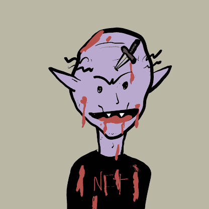

# Coffintownwtf

“我们糟透了。” - 座右铭。在（非）死亡中没有实用程序、社交媒体或路线图。只有一个免费的薄荷糖。所有资产 CC0。

Coffintownwtf NFT - 常见问题（FAQ）
▶ 什么是 Coffintownwtf？
Coffintownwtf 是一个 NFT（非同质代币）集合。存储在区块链上的数字艺术品集合。
▶ Coffintownwtf 代币有多少？
总共有 10,000 个 Coffintownwtf NFT。目前，2,900 名业主的钱包中至少有一个 Coffintownwtf NTF。
▶ 最昂贵的 Coffintownwtf 销售是什么？
出售的最昂贵的 Coffintownwtf NFT 是 COFFINTOWN.WTF #9982。它于 2022 年 6 月 19 日（2 个月前）以 0.6 美元的价格出售。
▶ 最近卖出了多少 Coffintownwtf？
过去 30 天内共售出 1 个 Coffintownwtf NFT。
▶ 什么是流行的 Coffintownwtf 替代品？
许多拥有 Coffintownwtf NFT 的用户还拥有 Kristmiha 的 Forbidden Worlds、 High Gas NFT、 Tesseracts | 作者：Aki Amida和 trollcave.wtf。

