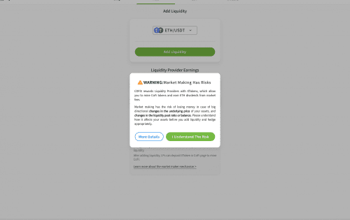
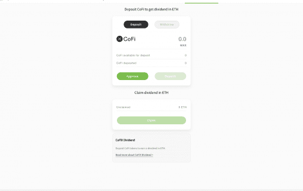

# CoFiX

CoFiX 是一个社区驱动的 DeFi 项目。

CoFiX 是一种先进的自动化做市协议。 它从去中心化的价格预言机获取市场价格。 此外，它具有完善的风险控制机制。 设计原则如下。

1． 可计算性和基于算法的风险控制。

2． 没有系统级套利机会。

**一般代币分配：**

**矿池 A**产生的 80% 的代币流向交易者，10% 流向流动性提供者

相应资产池中的 10% 归节点（开发团队和早期支持者）。

**矿池 B**产生的代币 100%流向流动性提供者，每个资产池平均分配，流动性提供者可以根据他们投入流动性挖矿的 XToken 数量从流动性挖矿奖励池中领取代币。

**矿池 C**生成的代币 100%流向节点。节点可以根据其持有的节点代币数量从节点奖励池中领取代币。因此，节点始终会收到通过 3 个矿池生成的总代币的 10%。

