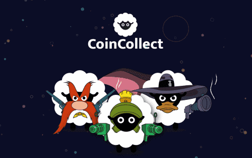

# Coin Collect NFTs

CoinCollect 是一种在多链上运行的去中心化 NFT 金融协议，可帮助 NFT 交易者、高收益农民、流动性提供者、开发商和 web 3.0 初创公司参与开放的金融市场，没有进入障碍。

CoinCollect 具有多链 NFT 启动板功能和硬币分发平台。 理想的 Launchpad，旨在满足 NFT 和 DeFi 领域最佳项目的需求。 质押从未如此无风险。 质押您的 NFT，再也不会有无常的损失。

铸造你的免费 NFT（如果有的话），或者只是购买你想要的 NFT 并加入一个池来赚取新推出的代币或 NFT

#### 什么是 CoinCollect？

CoinCollect 是一个基于多链 NFT 的 DeFi 平台，用户通过将 NFT 作为抵押品来获得加密或 NFT 奖励。

#### 发射台

CoinCollect 启动板，为启动新币、NFT 和加密项目提供独特的工具集，帮助新项目提高流动性。

#### NFT DeFi

通过 NFT DeFi 赚取被动收入的最简单方法是将您的 NFT 质押或将您的加密货币存入 CoinCollect，这将为您支付 APY。

#### 多链IDO

CoinCollect 是一个去中心化平台，用于参与和授权即将到来的加密/NFT 项目。一旦 IDO 上线，投资者就会购买代币。
