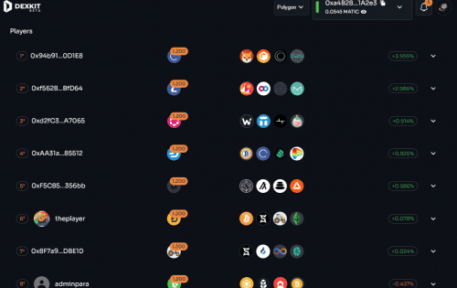
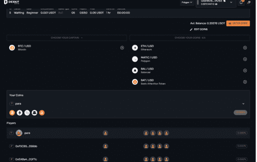

# Coin League

用户将能够通过预测市场上最佳定位的加密货币的价格来相互竞争。 在看涨或看跌的市场中，在一定的时间间隔内，给每场比赛额外的激情。 该游戏还使用 Chainlink 的预言机实时准确和防篡改价格。 通过实用 NFT，用户将能够通过在为其适当建立的房间内增加他们的船长硬币来增加他们获胜的机会。 应该注意的是，在这个游戏中用户不必购买任何会员或计划。 用户只需支付报名费，如果他们赢得其中一个奖项，BNB或MATIC的奖金将自动发送到他们的钱包。 该游戏是交易者衡量风险和了解加密市场趋势的完美培训。

# 关于游戏

我们社区建议的“价格游戏”、“硬币运行”、“加密货币赌注”等名称是加密货币用户和游戏玩家将在加密货币世界中发现的最具创新性的游戏，**将挑战他们的技术和经验**作为短期/中期/长期价格预测者的**技能，提高体育精神，与朋友和同事共度宝贵时间，并让他们了解加密市场的最新创新**

