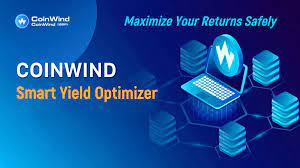

# Coin Wind

CoinWind是一个DeFi智能挖矿金融平台，通过合约自动匹配质押代币，配合无常对冲策略，最大化用户收益，有效解决单币种和LP挖矿收益低、LP挖矿无常的问题 大额损失等风险问题。

CoinWind 旨在打造 DeFi 数字资产银行，推出集高收益、安全、可靠于一体的产品，将用户存入的不同代币汇集到不同的池中，然后从某个代币池中调动资金参与不同的 流动性意义，从而为用户实现更高的收益。

CoinWind已上线HECO、BSC、ETH，将上线并支持Polygan、Solona等主链。

## 我们解决什么？

CoinWind 有效地解决了 DeFi 领域的一个关键问题，即使在我们项目启动的早期阶段，它也为我们的天文数字式增长做出了贡献。我们设法解决了无常损失的问题，这是用户在提供流动性时面临的巨大风险因素。

希望通过流动性挖矿获得被动收入的参与者需要提供 50/50 比例的代币对。这是必要的，因为令牌对使去中心化交易所 (DEX) 能够发挥作用，从而允许其他人轻松交易。然后，参与者将能够赚取与给定池的交易量正相关的部分交易费用。

然而，这会产生无常损失的问题，与将资产放入流动资金池 (LP) 相比，用户可能会更好地持有资产。当每个代币的价格随着时间的推移而变化导致您存入的资产价值低于您的初始投资时，就会发生永久性损失。这是因为当池中的资产耗尽而另一种资产涌入时，流动性池将有兴趣维持池中代币的比率。因此，当一个代币的价格上涨而另一个保持不变时，套利交易者将平衡它，这可能导致次优结果。

## 
