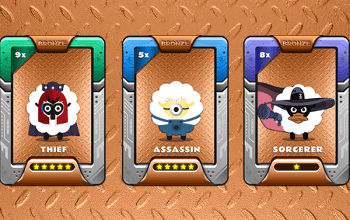
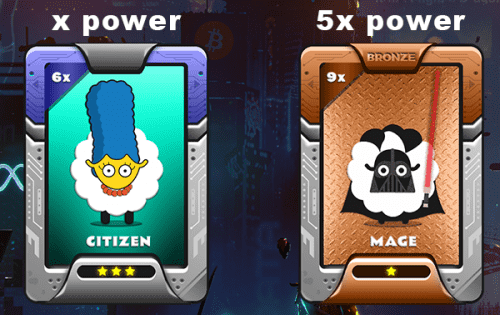

# CoinCollect Bronze NFT

CoinCollect NFT 可抵押、可交易，并为其所有者提供特殊礼物。

拿起您的 NFT 并开始收集新硬币、空投新硬币或出售/交易您的 NFT。 CoinCollect 是一种在多链上运行的去中心化 NFT 金融协议，可帮助 NFT 交易者、高收益农民、流动性提供者、开发商和 web 3.0 初创公司参与开放的金融市场，没有进入障碍。

## 空投

所有 NFT 拥有者都将获得新的代币。即使是免费的 NFT 拥有者也将获得包括 $COLLECT 在内的新币/代币。

