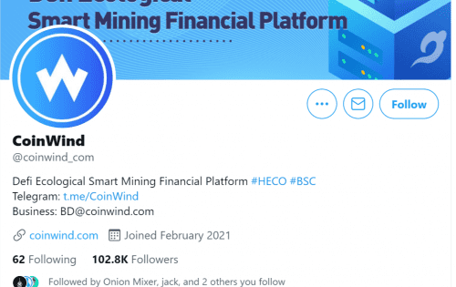
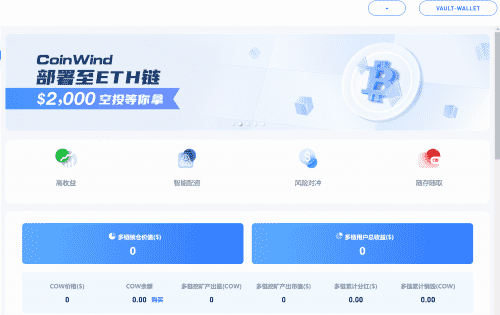

# Coinwind

CoinWind是一个DeFi智能挖矿金融平台，通过合约自动匹配质押代币，配合无常对冲策略，最大化用户收益，有效解决单币种和LP挖矿收益低、LP挖矿无常的问题 大额损失等风险问题。

CoinWind 旨在打造 DeFi 数字资产银行，推出集高收益、安全、可靠于一体的产品，将用户存入的不同代币汇集到不同的池中，然后从某个代币池中调动资金参与不同的 流动性意义，从而为用户实现更高的收益。

CoinWind已上线HECO、BSC、ETH，将上线并支持Polygan、Solona等主链。

# 介绍

DeFi 领域有多种产品可供您选择，如果没有关于它们的完整信息，您可能会目瞪口呆。在 CoinWind，我们提供 3 种主要产品，即 Staking、Single Token Mining 和 LP Mining，我们将在其中为您分解和比较它们。在本文中，我们总结了您应该了解的每种产品的关键点，以帮助您在决定哪种产品最适合您的需求时做出决策。

