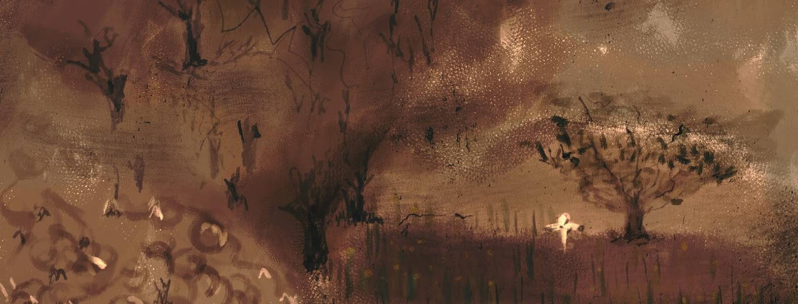

# Corners of a Labyrinth

荒凉、死亡和绝望，带着一丝美丽。

ERC - 使用@manifoldxyz 铸造的 721 个代币，1/1 数字绘画

迷宫的角落 NFT - 常见问题（FAQ）
▶ 什么是迷宫的角落？
迷宫的角落是一个 NFT（非同质代币）集合。存储在区块链上的数字艺术品集合。
▶ 迷宫的角落代币有多少？
迷宫 NFT 总共有 14 个角落。目前 4 位所有者的钱包中至少有一个迷宫 NTF 的角落。
▶ 最近卖出了多少个迷宫的角落？
过去 30 天内售出 0 个 Corners of a Labyrinth NFT。

