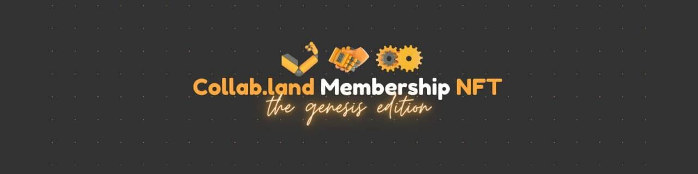

# Collab.Land Genesis Membership NFT

Collab.Land Genesis Membership NFT 统计
创建于 10 个月前
28,311 代币供应
10% 费用
过去 7 天内没有出售 Collab.Land Genesis Membership NFT。

截至太平洋标准时间 21 年 10 月 31 日上午 7 点通过 Collab.Land 进行验证的任何人都可以在https://wagmi.collab.land申请会员 NFT

这款互动玩具是由才华横溢的Popil专为 Collab.Land 会员打造的。

享受！💛

Collab.Land Genesis Membership NFT NFT - 常见问题（FAQ）
▶ 什么是 Collab.Land Genesis Membership NFT？
Collab.Land Genesis Membership NFT 是一个 NFT（不可替代代币）集合。存储在区块链上的数字艺术品集合。
▶ Collab.Land Genesis Membership NFT 代币有多少？
总共有 28,311 个 Collab.Land Genesis Membership NFT NFT。目前，25,426 名所有者的钱包中至少有一个 Collab.Land Genesis Membership NFT NTF。
▶ 最近卖出了多少 Collab.Land Genesis Membership NFT？
过去 30 天内售出了 4 个 Collab.Land Genesis Membership NFT NFT。
▶ 有哪些流行的 Collab.Land Genesis Membership NFT 替代品？
许多拥有 Collab.Land Genesis Membership NFT NFT 的用户还拥有 Coinhub NFT V2、 BlockedHeads、 Mad Blob Records和 tiny MOAR (poly)。

