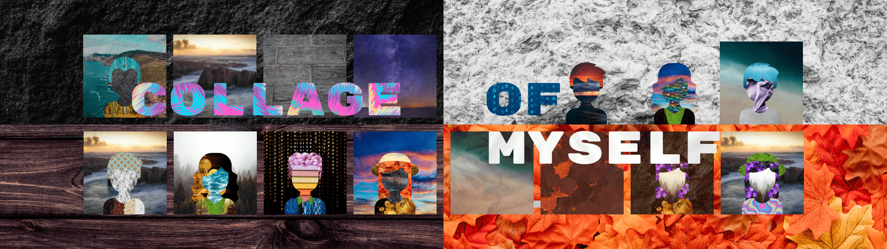

# Collage of Myself

**我自己的拼贴画**

集合 1 - 部署在多边形网络上

独特的 500 个不同背景和纹理的自动生成拼贴画来表达自己。每一块都是部署在 Polygon 区块链上的 ERC721 代币。

属性

- 背景：一组20种不同稀有度的不同背景；
- 字符：一组 5 个不同的字符，这些字符控制着下面所有其他属性的形状；
- 身体;
- 头发;
- 衣服;
- 服装：配饰（可选）。

路线图

- 在网站上添加仅对令牌持有者可见的部分。
- 在网站上添加一个 3d 画廊，NFT 持有者可以根据需要在那里展示。（[https://gallery.collageofmyself.com](https://gallery.collageofmyself.com/)）
- 与其他 NFT 项目合作以获得更多曝光。

