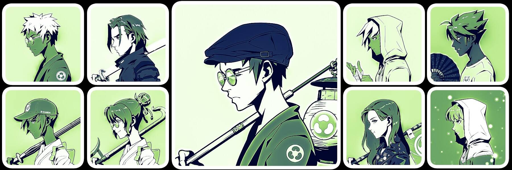

# ColoredAzuki

**有色小豆统计**

创建于 4 个月前，1,515 代币供应，10% 费用

过去 7 天内没有出售 ColoredAzuki。

大多数时尚 NFT 系列“Azuki”的彩色版本。我们每天都有赠品，已经有数十名幸运获奖者。访问我们的 Twitter，成为下一位幸运儿。

ColoredAzuki NFT - 常见问题（FAQ）
▶ 什么是 ColoredAzuki？
ColoredAzuki 是一个 NFT（不可替代代币）集合。存储在区块链上的数字艺术品集合。
▶ 有多少 ColoredAzuki 代币？
总共有 1,515 个 ColoredAzuki NFT。目前，18 位车主的钱包中至少有一个 ColoredAzuki NTF。
▶最近卖出了多少ColoredAzuki？
过去 30 天内共售出 0 个 ColoredAzuki NFT。
▶ 什么是流行的 ColoredAzuki 替代品？
许多拥有 ColoredAzuki NFT 的用户还拥有 0xImaginary、 MixedApeCollection、 thedoodles.eth和 NeonFriends。

