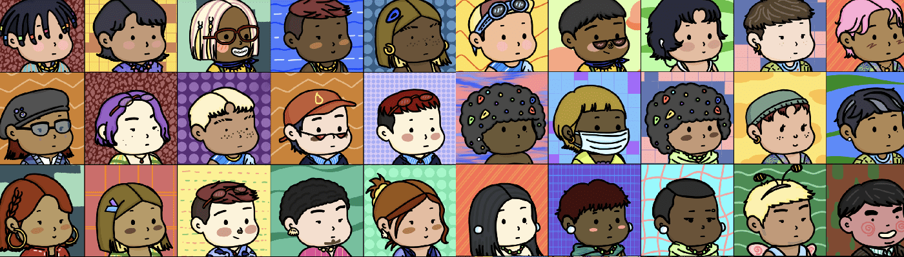

# Colorful Friends Club

多彩的朋友俱乐部 (CFC) 是由 10,000 个可爱而多彩的角色组成的集合。俱乐部分为3个等级：Normal（7500张图片）、Rare（2200张图片）随机生成和Unique（300张图片）手绘。多彩朋友俱乐部（CFC）是属于多彩世界项目的集合，而多彩世界是一个美丽而快乐的世界观，旨在传递和平与幸福的信息。我们反对任何基于种族、民族、肤色或宗教的歧视，并将带头传播艺术带来的治愈和转化力量。 “Be you Be your color！”多彩朋友俱乐部 (CFC) 包含 10,000 个可爱、多彩的角色。我们的集合包括随机生成的正常 (7500) 和稀有 (2200) 字符以及手绘独特字符 (300)。 CFC 是属于多彩世界项目的一个集合，而多彩世界是一个美丽而幸福的世界观，旨在传达和平与幸福的信息。多彩世界计划反对任何基于种族、民族、肤色或宗教的歧视，并将带头传播艺术带来的治愈和转化力量。 “做你做你的颜色！”

