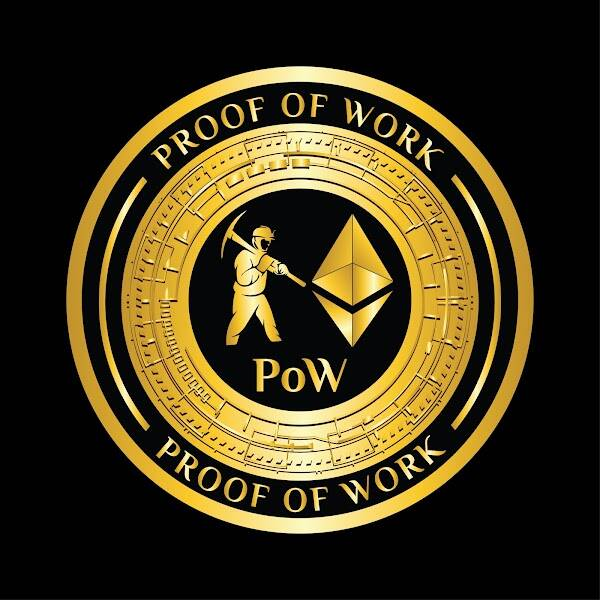

# Commemorative Merge Coin

**合并纪念币**

这枚纪念币庆祝了以太坊从工作量证明 (PoW) 到权益证明 (PoS) 的历史性转变。总共将铸造一百枚硬币。

最初，硬币将以 PoW 面朝上的方式显示。合并发生后，所有者可以选择通过智能合约中的功能将他们的硬币翻转到 PoS。请记住，翻转是不可逆的！

哦，如果您深入研究智能合约代码，您可能会发现一个惊喜😉。

工作证明：销售将于 2022 年 9 月 23 日上午 9:41 GMT+8结束 

工作量证明是以太坊在 The Merge 之前使用的共识机制。

