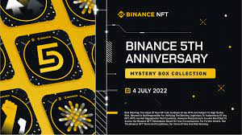
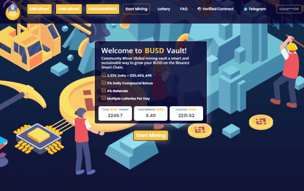

# COMMUNITY BUSD

<ul>
  <li>采矿游戏的运作方式与任何其他金融市场类似，其中资产的内在价值与该资产的供需相关。矿工以相对于矿工当前采矿效率的价格以预先确定的货币购买。购买矿机后，他们会立即为您工作，以尽可能长时间地为您提供最佳投资收益。就像在公开市场上买卖的任何其他资产一样，矿工的价格会随着时间的推移而波动，采矿效率也会随着您和其他参与者雇佣矿工、复合收益和口袋收益而波动。说白了，对矿工的需求越多，他们的价值就会增加得越多，产出的收益也就越多。相反，当需求减少时，矿工的价值和他们的每日投资回报也会减少。矿工与传统金融市场的主要区别在于，矿工不能被出售，只能出售他们提供的价值。随着游戏玩家作为一个整体进行复合收益并进行新的存款，挖矿效率将保持相对恒定，但当玩家开始提取超过他们的复合时，挖矿效率将开始下降，以保持矿工的 TVL 和寿命。</li>
</ul>

**什么是 BUSD 矿工？**

BUSD Miner 是一款基于币安智能链的去中心化游戏。游戏的目的是比其他玩家更快、更频繁地雇佣更多的矿工。这反过来又可以更快地为您赚取更多的 BUSD。这些矿工不知疲倦地为你工作，平均每天支付你矿工价值的 3%。每日百分比回报取决于用户在平台内采取的影响矿工效率的行动。挖矿效率随着用户雇佣矿工、复合收益和口袋 BUSD 奖励而上升和下降。一旦矿工被雇佣，他们就不能被出售，购买他们的投资（通过存款或复利）也不能收回。然而，一旦购买，

注意：这款游戏的可持续性和寿命将取决于每个玩家的行为。将您的收入至少与您口袋里的收入一样多，这一点至关重要。一旦有人没有尽自己的一份力量，整个游戏就会开始受到影响。传播信息并招募更多玩家加入也很重要。如果每个人带来两个人，并且每个人都按照它的意思玩游戏，那么每个人都会赢。尽自己的一份力量，这款游戏将持续很长时间！

