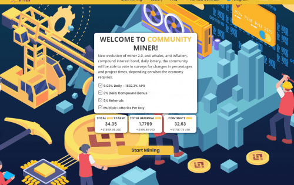
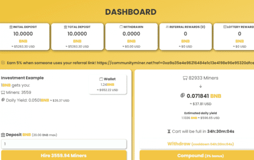

# COMMUNITY MINER 2.0

<strong>是什么让这个矿工与众不同？</strong>

很高兴您提出要求！ Community Miner 制定了多项反倾销和反鲸鱼措施，以确保项目的寿命。这些措施包括最大存款，最大提款，以及提款的截止时间和冷却时间，仅举几例。 ;) 还有一个内置的复利奖金，每天你在不退出的情况下复利。这会激励用户更频繁地进行复利，从长远来看，这将有助于提高矿工的效率。

但是等等！还有更多！社区矿工还有一个非常独特的功能，这是以前从未做过的，它有效地减少了长时间内发生的矿工通货膨胀量。每个卖出行动只会将已售鸡蛋的 5% 添加到市场鸡蛋供应总量中。请参阅智能合约中的第 228 行。较旧的矿工合同将 100% 的已售鸡蛋添加到总供应量中。这意味着合约的通胀率会更低！

**什么是社区矿工？**

Community Miner 是一个基于币安智能链的去中心化应用程序，平均每天向您支付 5% 的 BNB 存款到 Community Miner 合约。每日 ROI 百分比取决于用户在平台内采取的影响矿工效率的操作。挖矿效率随着用户雇佣矿工、复合收益和口袋 BNB 奖励而上升和下降。社区矿工：约 5% 的每日利息合约基础。（投资者可以通过调查决定降低到 3.5% 或提高到 11.5%，具体取决于项目的经济情况。) ~ 5% 推荐奖金。~ 每天 5% 的复合奖金，最多连续 10 天。(30%) ~ 0.005 BNB 最低投资。~ 中断时间 36 小时 ~ 撤回冷却 6 小时 ~ 每投资/复合增加 5% 的矿工供应（其他矿工 20%）。*这意味着较低的通货膨胀率。社区彩票：每笔存款或复利的 1% 将被放入底池中。~ 金额不会扣给用户，将是奖金。~ 抽奖将每 4 小时或 100 名参与者运行一次。~ 每个用户最多 50 张门票。0.25 BNB = 50 张门票。~ 0.005 bnb = 每张票 1。基于用户存款/复合。~ 90% 的底池将分配给中奖地址。鲸鱼控制功能：~ 36 小时截止时间。~ 6 小时撤回冷却时间。~ 10 bnb 最大提款。每个钱包最多可存入 20 亿美元

