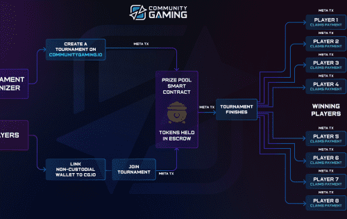

# CommunityGaming.io

Community Gaming 是一体化的电子竞技竞赛平台，为主要的行业利益相关者提供尖端的基础设施。 通过其无缝的用户体验以及高度可扩展和高效的区块链支付技术，该平台为玩家、公会和游戏开发者提供了创建、促进和参与电子竞技比赛所需的工具。&nbsp;

Community Gaming 相信每个人的收益，其中更广泛的电子竞技和游戏行业的巨大收益是分散的，并且可以通过 web3 技术获得，以奖励行动和时间。

**加入我们的社区**

除了我们的每周在线锦标赛外，我们还在我们的合作地点网络中在美国各地举办现场活动。Community Gaming 已为英雄联盟、DOTA 2、CS:GO、Valorant 和 Super Smash Bros, Ultimate 等全球顶级电子竞技举办了 100 多场赛事。

