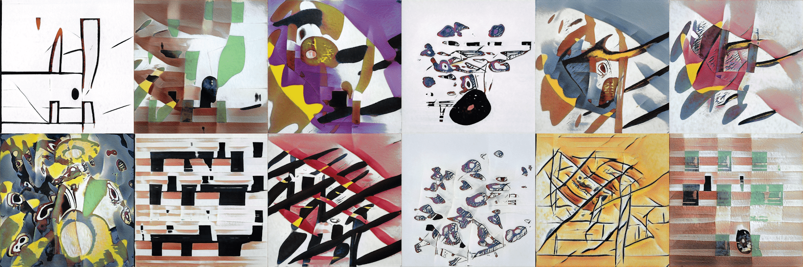

# Complexio

**复杂度统计**

创建于 9 个月前，245 代币供应，8.88% 费用

过去 7 天没有售出 Complexio。

Complexio 是一个专注于实验的艺术团体。我们对设计和博弈论动力学进行了实验。为了创造我们的艺术，我们的开发团队创建了一种先进的机器学习算法，训练有数千个最佳抽象艺术的例子

Complexio NFT - 常见问题（FAQ）
▶ 什么是 Complexio？
Complexio 是一个 NFT（不可替代代币）集合。存储在区块链上的数字艺术品集合。
▶ 有多少 Complexio 代币？
总共有 245 个 Complexio NFT。目前，74 位所有者的钱包中至少有一个 Complexio NTF。
▶ 最近卖出了多少 Complexio？
过去 30 天内共售出 0 个 Complexio NFT。

