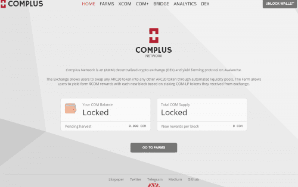
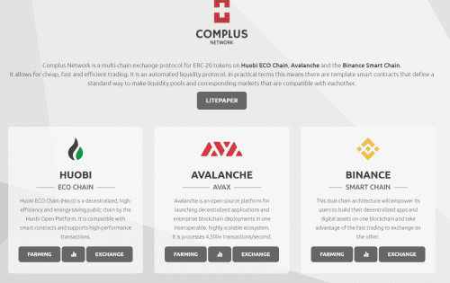

# Complus

Complus Network 有一个名为 COM 的原生治理代币，可以买卖在所有三个链上发行的所有代币。在拥有多个竞争对手的拥挤市场中，它提供了三个至关重要的好处：便宜且快速的交易、社区驱动的开发和公平的代币分配。 Complus Network 可以快速且廉价地完成交易。它使用户能够交易资产，同时享受亚秒级的交易终结性和低至几美分的交易费用。原生治理代币 COM 使社区能够全面推动产品的开发。 COMPLUS 网络 DEX 是如何工作的？ Complus Network DEX 是一个自动做市（AMM）去中心化交易所。实际上，这意味着现有的模板智能合约定义了一种使流动性池和相关市场相互兼容的标准方法。每个池都由智能合约定义，其中包括各种功能，以实现代币交换、增加流动性等。当用户进行交易时，将收取 0.3% 的交易费用。该交易的 0.25% 回到 LP 池。这笔费用的 0.05% 以 COM-LP 代币的形式添加到 Complus 权益池中，您可以在其中质押 COM 以换取从股息中增值的代币 xCOM。

# 关于我们的桥梁

Complus Network 是 Heco 和 Avalanche 上最早的 dex 项目之一。推出后不久，ChainSafe 的 ChainBridge 激活了桥接系统。

起初我们使用包装的令牌系统。在接下来的过程中，我们看到很多人在跨链出售他们的 com 代币，并购买了包装好的代币，并因合约问题将其从系统中删除。

正因为如此，桥梁系统中的1：1比例受到了严重破坏。

为了解决这个问题，我们取消了打包的代币合约，并为桥接系统激活了 plustoken 合约。这些合同完美无缺。

这方面最重要的指标是 Matic 链。1:1 的比例在 Matic 中仍然可以顺利运行，这在桥接系统中是没有的。

Heco、Avalanche 和 Binance Smart Chain 在第一个过程中被打破的平衡永远无法重新建立。我们对此无能为力。

出于这个原因，我们决定删除我们在 Heco、Avalanche 和 Bsc 网站中用于 1:1 转换的面板以及菜单中的链接。

我们已经开通了 Ht+、Avax+ 和 Bnb+ 代币池，我们将通过组织空投将 Com+ 代币发送给这些代币持有者。

很快我们将限制桥接系统上的 Com+ 传输

