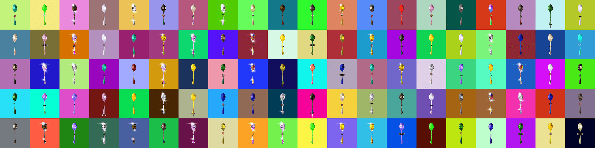

# The Concave Spoons

**凹勺统计**

创建于 8 个月前，3,585 代币供应，9.5% 费用

过去 7 天没有售出 The Concave Spoons。

凹形勺子是 4317 个随机生成的独特勺子的独家收藏。集合中使用的背景是颜色 NFT，顺序完全相同。在叉子、勺子的世界里。

**The Concave Spoons NFT - 常见问题（FAQ）**
▶ 什么是凹形勺子？
Concave Spoons 是一个 NFT（不可替代代币）集合。存储在区块链上的数字艺术品集合。
▶ 有多少 The Concave Spoons 代币？
总共有 3,585 个 The Concave Spoons NFT。目前，1,473 位车主的钱包中至少有一个 The Concave Spoons NTF。
▶ 最近卖出了多少 The Concave Spoons？
过去 30 天内共售出 0 个 The Concave Spoons NFT。

