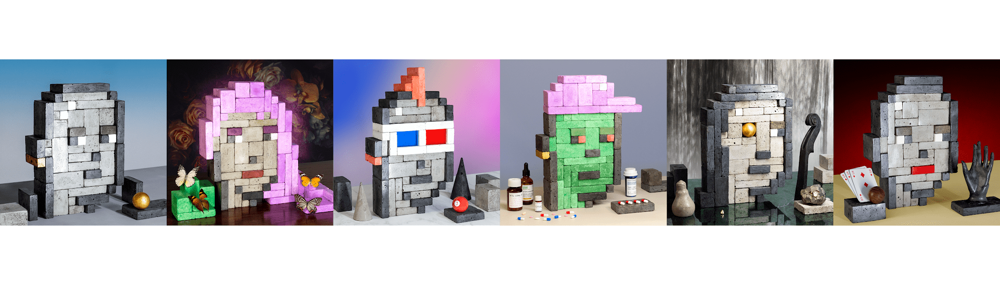

# ConcretePunks

**具体朋克统计**

创建于 8 个月前，7 代币供应，10% 费用

过去 7 天内没有出售混凝土朋克。

ConcretePunks 穿越物理和元；由真正的混凝土块手工制成，并在以太坊上栩栩如生，然后在物理世界中被永久解构。

[Prorok.eth](https://twitter.com/proroketh)的静物 PFP 项目

ConcretePunks NFT - 常见问题（FAQ）
▶ 什么是混凝土朋克？
ConcretePunks 是一个 NFT（不可替代令牌）集合。存储在区块链上的数字艺术品集合。
▶ 存在多少个 ConcretePunks 代币？
总共有 7 个 ConcretePunks NFT。目前 3 位所有者的钱包中至少有一个 ConcretePunks NTF。
▶ 最近卖出了多少个混凝土朋克？
过去 30 天内售出了 0 个 ConcretePunks NFT。

