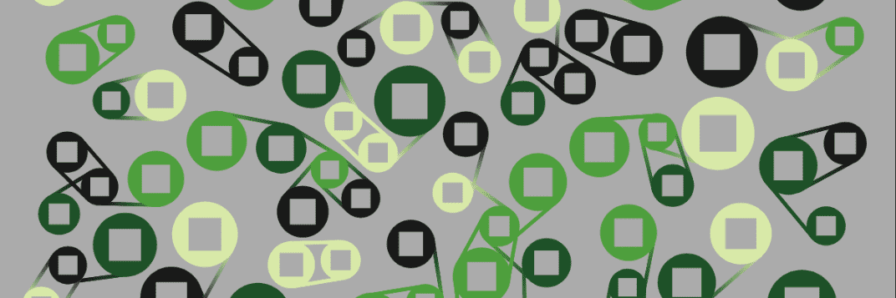

# ConnectionsNFT

**ConnectionsNFT 统计**

创建于 3 个月前，1,000 代币供应，7.5% 费用

过去 7 天没有出售 ConnectionsNFT。

P5 生成的艺术品，简单的氛围。每个令牌都是使用来自您的 tx 和令牌 ID 的哈希生成的。

ConnectionsNFT NFT - 常见问题（FAQ）
▶ 什么是 ConnectionsNFT？
ConnectionsNFT 是一个 NFT（不可替代令牌）集合。存储在区块链上的数字艺术品集合。
▶ 存在多少个 ConnectionsNFT 代币？
总共有 1,000 个 ConnectionsNFT NFT。目前，468 位所有者的钱包中至少有一个 ConnectionsNFT NTF。
▶ 最近卖出了多少 ConnectionsNFT？
过去 30 天内售出 0 个 ConnectionsNFT NFT。
▶ 什么是流行的 ConnectionsNFT 替代品？
许多拥有 ConnectionsNFT NFT 的用户还拥有 NotLarvaLads、 skeletown wtf、 glitchartoriginal和 Okay Grandpa Bears。

