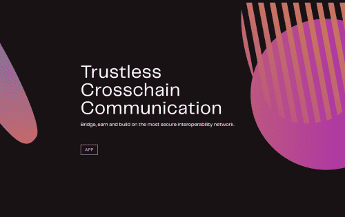
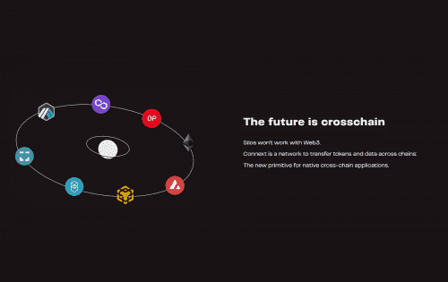

# Connext

您可以使用 Connext 跨链和/或汇总发送价值交易或调用数据。 与大多数其他互操作性系统不同，Connext 无需引入任何新的信任假设或外部验证器即可实现这一点。

请注意，当前版本的 Connext 不能用于在链之间传递任意事件数据（即向链 B 证明链 A 上发生了某些事情），因为这不能在 evm 中以信任最小化的方式完成，除非引发 现有 Rollup Bridge 的 1 周退出窗口。

这意味着不支持将代币从链 A<strong>迁移</strong>到链 B 之类的情况 - 您只能在链上已经存在的流动性上进行交换/交易。

**互联网**

**以太坊**

Connext在区块
链和汇总之间提供快速、安全的桥接，以实现
可组合的、信任最小化的价值。

### **未来属于 xApps。使用 Connext 构建它们。**

Connext 是一种**互操作性协议**，它使开发人员能够构建具有充分表现力的跨域应用程序 (xApps)，并重点关注**安全性**。

