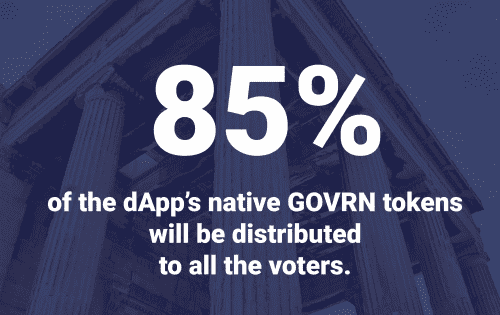
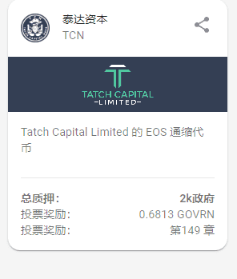

# Consortium

任何社会组织的去中心化、链上、基于激励的治理层。

# 介绍

Consortium 是一个去中心化的网络应用程序，使社区能够使用他们的代币来创建民意调查并在其中投票。

早在 2020 年 3 月，我们就在 EOS 主网上启动了Consortium。在 EOS 上运行时，我们获得了很多宝贵的知识。现在我们很高兴为您带来 WAX 上应用程序的改进迭代。

特别感谢 Galactic Hubs 的支持和 Max Infeld 鼓励我们扩展到 WAX。

# 如何使用联盟？

联盟被部署wax.consortium.vote。要与之交互，您需要与 WAX 主网（Anchor / WAX 云钱包）兼容的数字钱包。

用户可以做四件事：

1. 添加社区
2. 创建投票
3. 在投票中投票
4. 赌注

## 添加社区

任何人都可以将社区添加到 Consortium。添加后，您的社区成员可以开始创建民意调查、投票和质押。通过添加社区，您将成为其附属机构。

成为会员：

a) 如果您的社区活跃，则奖励您。

b) 使您能够适度（删除民意调查、更改社区信息/图像）。

c) 使您能够通过成为理事会的一员来确定 Consortium 的进一步发展路径（详细信息在代币经济学部分）。

