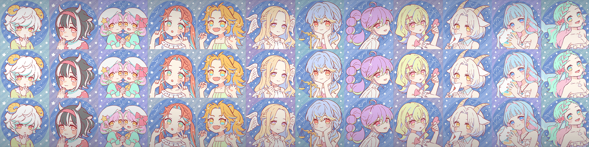

# Constellation Girls Collection

**星座少女3D合集统计**
创建于 9 个月前，24代币供应，10% 费用
137 个 Discord 成员，1,146 位推特关注者
Constellation Girls 3D Collection NFT 在过去 7 天被售出 1 次。Constellation Girls 3D Collection 的总销售额为 82.33 美元。Constellation Girls 3D Collection NFT 的平均价格为 82.3 美元。Constellation Girls 3D Collection 拥有者 55 人，共拥有 24 个代币。

CGC（星座少女合集）动人3D数位公仔合集！💫每个公仔有24份！在您的元宇宙画廊（例如 oncyber.io）上享受它！如果你能收集所有 12 种，会发生什么……？

如果您购买它：

它的预渲染视频 NFT 将空投给你！
我们将在我们的 Discord 服务器上为您提供一个头像 VRM 文件，您可以在 Metaverse 中使用它！
CGC（星座女孩收集）の3D3Dデジタルデジタル！それぞれにににににににに个ずつのみミントささますますますますますますますますのののののようメタバースメタバースギャラリーににに饰っ饰っ！！！！もしもしもしもしもしもしもしもしもしもしもしもしもしもしもしもしもしもしもしもしもしもしもしもしもしもしもしもしもしもしもしもしかが起こる……？

ご购入された方には：

プリレンダムービー版NFTをプレゼント！
メタバースでアバターとして使えるVRMファイルをDiscordサーバーで无料で配布します！

