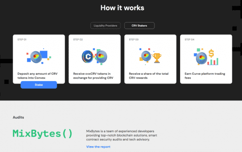
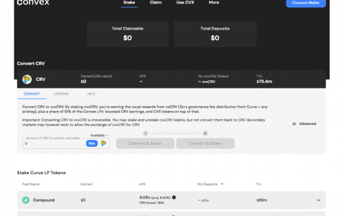

# Convex Finance

Convex 允许 Curve.fi 流动性提供者在不锁定 <strong>CRV </strong> 的情况下赚取交易费用并声称提升 <strong>CRV </strong>。 流动性提供者可以轻松获得提升的<strong>CRV</strong>和流动性挖掘奖励。

如果您想质押 <strong>CRV</strong>，Convex 让用户可以收到交易费用以及<strong>流动性提供者收到的提升 CRV 的份额</strong>。 这样可以更好地平衡流动性提供者和<strong>CRV</strong>利益相关者以及更好的资本效率。

<strong>Convex 没有提款费</strong>和用于支付 gas 并分配给 <strong>CVX </strong>stakers 的最低性能费。

<strong>CRV</strong>质押者和流动性提供者也以<strong>CVX</strong>的形式获得流动性挖矿奖励。

流动性提供者

**以更好的推动力赚取 CRV**

存入您的 Curve LP 代币以赚取 Curve 交易费、增强型 CRV 和 CVX 代币。

Boost 由 CRV 质押者汇集而成，因此您无需担心锁定自己。

CRV 质押者

**让您的 CRV 发挥作用**

除了 CVX 代币和 Curve 交易费用之外，质押并赚取额外的 CRV。

令牌

**质押 CVX 并赚取更多**

将您的 CVX 奖励押回平台并赚取平台费用。

