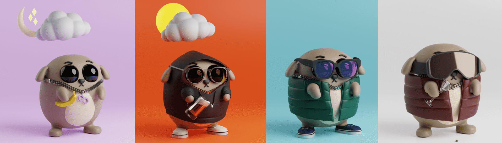

# CookieTheDogV2

**CookieTheDogV2 统计**
创建于 10 个月前，111代币供应，2.5% 费用
过去 7 天内没有售出 CookieTheDogV2。

Cookie The Dog V2 是生活在 Polygon 区块链上的一只可爱，有时还很淘气的小狗。每个 Cookie 都是单独制作的，具有独特的属性组合，这意味着没有使用随机生成器。只会创建 111 个。

在此处查看集合 1：https ://opensea.io/collection/cookiethedog

在此处查看集合 3：https ://opensea.io/collection/cookiethedogv3

在此处查看集合 4：https ://opensea.io/collection/cookiethedogv4

查看集合 LE1：https ://opensea.io/collection/cookiethedoglimitededition1

查看集合 LE2：https ://opensea.io/collection/cookiethedoglimitededition2

查看集合 LE3：https ://opensea.io/collection/cookiethedoglimitededition3

**CookieTheDogV2 NFT - 常见问题（FAQ）**
▶ 什么是 CookieTheDogV2？
CookieTheDogV2 是一个 NFT（不可替代令牌）集合。存储在区块链上的数字艺术品集合。
▶ 存在多少个 CookieTheDogV2 代币？
总共有 111 个 CookieTheDogV2 NFT。目前，44 位所有者的钱包中至少有一个 CookieTheDogV2 NTF。
▶ 最近卖出了多少 CookieTheDogV2？
过去 30 天内售出了 0 个 CookieTheDogV2 NFT。

