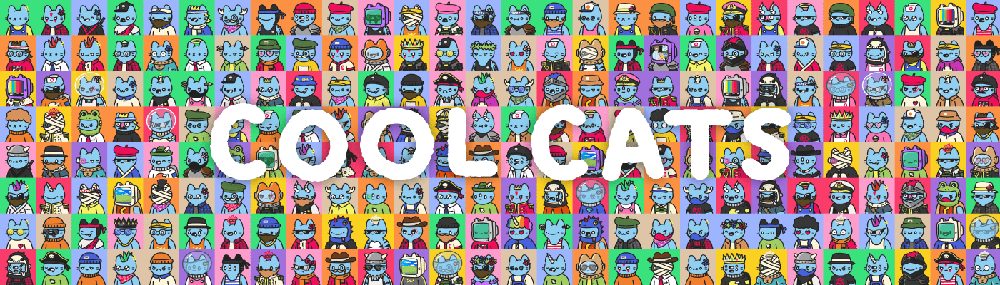

# Cool Cats Saudis

**酷猫 NFT 统计**

创建于大约 1 年前，9,952 代币供应，OpenSea 验证集合，5% 费用

98,272 名 Discord 成员

205,178 位推特关注者

Cool Cats NFT NFT 在过去 7 天内售出 137 次。Cool Cats NFT 的总销售额为 47.296 万美元。一个 Cool Cats NFT NFT 的平均价格为 3.5 万美元。Cool Cats NFT 拥有者 5,633 名，总供应量为 9,952 个。

Cool Cats 是存在于以太坊区块链上的 9,999 个随机生成和风格策划的 NFT 的集合。酷猫持有者可以参与 NFT 认领、抽奖、社区赠品等独家活动。请记住，所有的猫都很酷，但有些猫比其他猫更酷。

