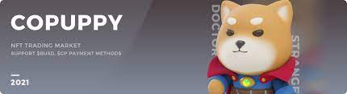
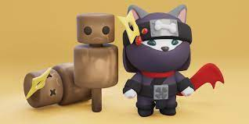

# CoPuppy

CoPuppy 是 BSC 上最具吸引力的元界项目。 项目包括收藏品、游戏、金融等，构建一个开放的小狗世界。 CoPuppy拥有独特的生态系统和经济模型，结合了当前流行的挖矿、NFT、GameFi、元界等流行概念，并在此基础上进行创新。

# CoPuppy Metaverse — 使用快速手册

小狗世界由七个不同的区域组成，每个区域都有不同的功能和特点，甚至每个区域的“帮派”也各有千秋。

在小狗世界，你需要密切关注各个区域的发展和各自的功能，才能在这个疯狂的世界中生存。

# 市中心

Genesis DAO 总部和市政厅位于此处。在小狗世界的中心，Genesis DAO 将决定小狗世界的发展方向。

Genesis DAO 目前有 10 名成员。这10名成员将遵循“Doge”一票制，讨论与Puppy World命运相关的重大决策，如住房和土地规划、采矿税法、PVP竞技场规则等。
在小狗世界的建设初期，项目组将扮演Genesis DAO的角色，直到小狗世界的基础设施完成后，才会将权利转让给Genesis DAO。

