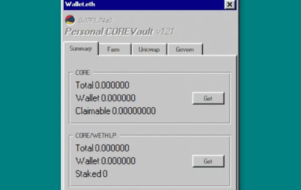

# CORE Vault

CORE 是一种非通胀加密货币，旨在以完全去中心化的方式自主执行创利策略。 在现有的自主战略执行平台中，一个团队或单个开发人员单独负责确定如何使用锁定资金来产生 ROI。 随着基金的成长，这对基金的健康是有害的，因为它会产生有缺陷的激励措施，并导致犯错。 CORE 摒弃了这种动态，而是选择了去中心化治理。

CORE 代币持有者将能够提供策略合约，并对上线的内容和时间进行投票，以分散自治策略的执行。 这些策略产生的所有利润的 5% 用于汽车市场购买 CORE 代币。

