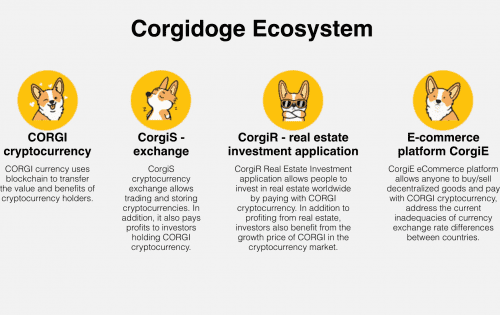
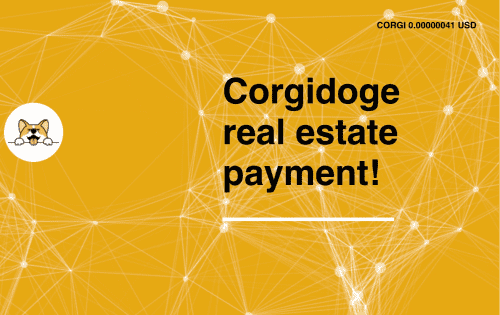

# Corgidoge

<strong>什么是科尔吉多奇 (CORGI)？</strong> 生态系统

Corgidoge 是一个房地产投资应用程序，电子商务平台，加密货币交易所旨在最大化 CORGI 币的利益。长期发展导向的CORGI将成为广泛使用的代币之一，取代现有的代币。

CORGI 货币使用区块链来转移加密货币持有者的价值和利益

CorgiS 加密货币交易所允许交易和存储加密货币。此外，它还向持有 CORGI 加密货币的投资者支付利润。

CorgiR 房地产投资应用程序允许人们通过使用 CORGI 加密货币付款来投资全球房地产。投资者除了从房地产中获利外，还受益于 CORGI 在加密货币市场的增长价格。

CorgiE 电子商务平台允许任何人购买/出售去中心化商品并使用 CORGI 加密货币进行支付，解决当前各国货币汇率差异的不足。

## 科尔吉多奇

我们的愿景是围绕Corgidoge构建一个包括空间、工作社区、房地产投资应用、电子商务平台、加密货币交易所在内的适合所有人的生态系统。该系统将鼓励对 CORGI 加密货币的接受和使用，以帮助促进需求并为未来的可持续发展创造价值。

一个房地产投资应用程序，电子商务平台，加密货币交易所旨在最大限度地发挥 CORGI 硬币的利益。长期发展导向的 CORGI 将成为广泛使用的代币之一，并取代现有的代币。
