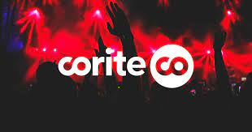
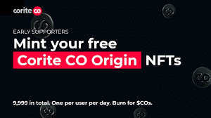

# Corite

Corite (CO) 是一家瑞典音乐和科技初创公司，成立于 2018 年，有自己独特的方式来资助艺术家。它的作用是让粉丝投资音乐并分享流媒体利润，成为从产品创建到实施过程中不可或缺的积极部分。

平台测试版于 2019 年 10 月发布。 Corite商业模式的精髓在于：得益于粉丝的资金支持，艺人可以独立建立自己的事业，靠自己的作品赚钱。粉丝甚至可以参与创作过程并宣传他们最喜欢的音乐。同时，艺术家可以通过专门的粉丝团资助和发行他们的音乐。由于艺术家和粉丝之间的紧密联系，该计划有效。

Corite 与许多著名的音乐行业专业人士合作，例如 Hitco Entertainment 的创始人 L.A. Reid 和 Charles Goldstuck、传奇制作人 Rico Love（碧昂丝、Usher）和 Konstantin Kersting（Dance Monkey，4000 工作室）等等。最近，Corite 与 Alan Walker 达成了一项协议，将发布多首曲目并帮助将“Walkerverse”带入 Web3。

2022 年 1 月，Corite CO 成功完成了 620 万美元的私人代币销售，推出了即将推出的区块链平台。

## 这个怎么运作

一起分享成功

### 创建粉丝活动

邀请您的粉丝为您的下一个版本获得支持

**得到粉丝的支持**

用你筹集的资金来推销你的音乐并吸引你的粉丝

### 分享成功

获得免费分发并与您的粉丝分享收入
