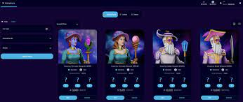

# Cosmic Wizards

Cosmic Wizards 是在 Harmony 区块链上的开放世界 Cosmic Universe MMORPG 中居住在 Crypton 星球上 Cosmic Island 的 10,000 名巫师的神奇集合。

-在 Harmony 区块链上以 0.0001 美元的费用和 2 秒的 tx 确定性铸造。

-将在即将到来的 3D 冒险 MMORPG Cosmic Universe 中使用的游戏化头像。

-拥有近 5,000 名成员的蓬勃发展的社区并不断发展

要玩 Cosmic Universe，需要一个角色 NFT 和陆地 NFT 才能充分利用游戏。

##### 什么是宇宙巫师？ 

Cosmic Wizards 是一个 NFT 集合，由 10,000 个可生成的游戏化头像（75% 男性，25% 女性）组成，可用于即将到来的区块链 MMORPG Cosmic Universe。拥有 Cosmic Wizard NFT 是您冒险、探索、社区和升级的门票，成为 Cosmic Universe 中的 Etherea Lumina。

##### 这与其他 NFT 集合有何不同？ 

Cosmic Wizards 在 Harmony 上带来了前所未有的东西，即代表游戏中 3D 角色的游戏化头像。每个 Cosmic Wizard 都充当 Cosmic Universe 的通行证，以及地块 NFT，并且可以通过玩游戏进行升级。关注我们的 Twitter @thecosmicguild 以查看我们即将推出的最新激动人心的更新

