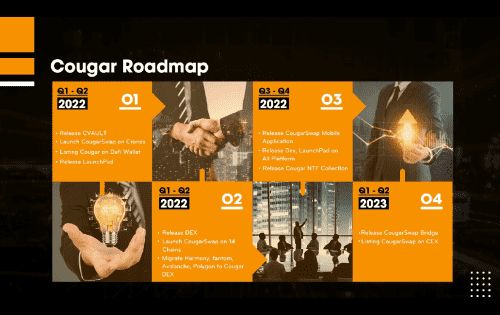

# CougarSwap

<strong>这是 Cougar 生态系统最近开发的项目，它提供了一个全面的奖励激励计划，在建立在最高稳定性和安全级别的多区块链网络上流通。</strong>

<strong>美洲狮生态系统如何运作？</strong>

由具有深厚区块链经验的团队实施。 CougarSwap 是一个长期的 DeFi 项目，自 2021 年 5 月以来一直在市场上，随着最初的 BSC 成功部署，我们现在享有 DeFi 市场上最负盛名的跨链项目之一的声誉。 DApp（去中心化应用程序）旨在为用户带来核心优势，即轻松访问构建 Cougar 生态系统的最充分的金融框架和模块之一。换句话说，在多个公共区块链网络上构建的可互操作的 Cougar 去中心化应用程序有可能创建一个完全多样化和独特的社区驱动平台。

<strong>突出特点：</strong>

缓慢预售声明：保持价格更稳定（阅读更多）

低存款费用：非原生矿池 3%

交易费用：自动销毁 2%

反鲸鱼：占总供应量的 20%

推荐计划：2%

<strong>系统特点：</strong>

农业

保险柜：自动复合

糖浆池：募集资金和合作伙伴关系

去中心化交易所

启动板

NFT

GameFi

桥

<strong>安全性：</strong>

长期项目✅

100% 流动性锁定✅

没有迁移代码✅

审计与点评✅

