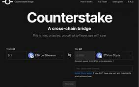
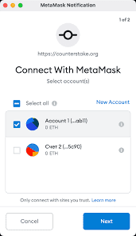

# Counterstake

Counterstake 是连接 Obyte、以太坊、BSC 和 Polygon 的完全去中心化的跨链桥。

在几分钟内在网络之间转移代币以享受更低的费用并使用其他网络上可用的 dapp。 该协议是完全去中心化的，这意味着没有中央方可以窃取您的资金、被黑客入侵或限制访问。

# 将身份带入加密货币

## 我们与 Jumio合作提供安全的身份验证，可以链接到 Byteball 地址并按需使用

为了与现实世界相关，我们需要更多的锚点到现实世界。其中之一是身份。

从今天开始，每个Byteball用户都可以将他的 Byteball 地址与他的真实身份相关联。用户的个人数据由领先的身份验证服务提供商Jumio进行验证，并存储在用户的 Byteball 钱包中。同时，个人数据的哈希值存储在公共 DAG 上，并由受信任的证明者签名。证明者也充当见证者，因此它已经被信任。

此证明允许用户向任何人证明他的 Byteball 地址与经过验证的人相关联，而无需透露任何个人信息。它还允许按需向各个服务提供商透露私人信息，服务提供商可以使用存储在公共 DAG 上的哈希轻松验证此信息的真实性。

