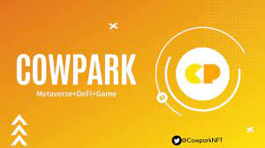
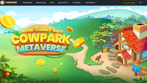

# CowPark

CowPark是一款基于币安智能链（BSC）的NFT模拟游戏（SLG）。

全球玩家可以采用牛NFT，升级牛NFT等级以获得更高的Staking收益，并获得回购保障。 NFT 奶牛可以出售、回收并入股市场以获得可观的收益，同时玩家可以享受身临其境的体验。

## 什么是CowPark？

CowPark是一款基于币安智能链（BSC）的NFT模拟游戏（SLG）。玩家将通过空投、神秘盒或购买获得Cow NFT。NFT奶牛还可以通过草料神化、动力道具和比赛等方式进行升级。NFT奶牛可以在市场上出售、回收和质押，在享受沉浸式体验的同时获得可观的收益。

在技术上，CowPark 采用了成熟的、创新的区块链编程来保证安全性和易于审计。它将通过创建性能卓越的链上智能交易机制，提供一个安全、透明和可互操作的加密货币园区。

CowPark 收入与奶牛水平正相关。2 级奶牛比 1 级奶牛拥有更高的哈希能力。CowPark通过结合NFT牛云挖矿模型和牛级模型，让用户更容易参与GameFi，在降低额外功耗的同时提升牛的算力值。

CowPark 的 NFT 是不同级别的 CrazyCow（简称 CZC），可以在 CowPark 商店或 NFT 市场自由交易，也可以在 CowPark 回收中心兑换。

