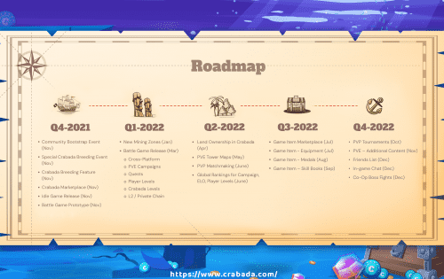
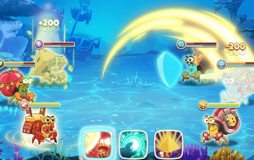

# Crabada

重新发现繁荣的古代克拉巴达王国，并通过采矿、抢劫、繁殖、战斗等活动获得奖励。更多的。 Crabada，作为一款闲置游戏，意味着您可以随时随地玩它，而不会对您的日常生活造成干扰。

💠独特的 PvP 注入空闲游戏&nbsp;

💠育种和市场&nbsp;

💠租借酒馆&nbsp;

💠强大的 2022 年路线图和游戏进度&nbsp;

💠游戏奖励和奖励

在 Crabada 中，玩家可以通过游戏赚取 CRA（治理代币）和 TUS（海底宝藏），即 Crabada 的游戏内货币。

<strong>🎮 跨平台对战游戏（2022 年第一季度）&nbsp;</strong>

Crabada 将于 2022 年第 1 季度在移动平台上推出，同时推出全新的沉浸式战斗游戏模式。 &nbsp;&nbsp;玩家可以观看激动人心的战斗，因为他们的 Crabada 在爪对爪战斗中施展独特的技能。

随着包含新的 PVE 区域和战役、PVP 锦标赛、土地所有权、设备甚至合作世界 Boss Raids，Crabada 有一个强大的路线图和游戏进度计划。

