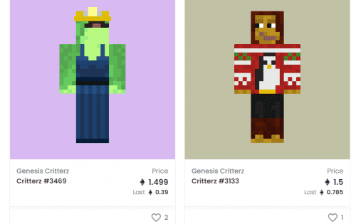
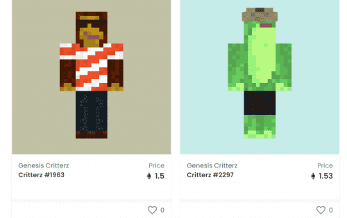

# Critterz Genesis

以太坊区块链上第一个完全链上 NFT&nbsp;在 Minecraft 上启用 P2E&nbsp;。 质押以在游戏中生成 $BLOCKs 并在虚拟世界中拥有土地。

**有史以来最活跃、最有趣的元节**

22,500 个创世纪地块可供索取。

每块土地都是 Critterz 元宇宙的永久成员。情节是无限可定制的，您完全拥有的 1:1 NFT。您可以将 Plots 变成一个景点、一个小游戏或一个在 Metaverse 中赚取 $BLOCK 的操作。

**具有 $BLOCK 的复杂玩家驱动型经济**

$BLOCK 为 Critterz 元节提供动力。您可以使用 $BLOCK 在市场上购买商品、请求服务或参加活动。这些游戏内交易是 100% 无气体的。

成为元节的一部分。

购买并质押 Genesis Critterz 以访问 P2E Minecraft 世界并在玩游戏时开始生成 $BLOCK。

