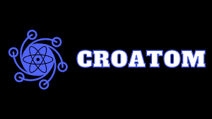
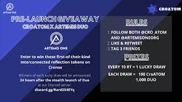

# CROATOM

CROATOM 是 CRONOS 链上第一个获得 $ATOM 奖励的代币。&nbsp;

只需持有代币即可自动获得 9% ATOM 再分配（反射）奖励！

## 税制

###### 9% 原子奖励

CROATOM 的每笔交易的 9% 以 ATOM 代币的形式分发给 CROATOM 的持有者（也称为反射）

###### 1% 自动流动性

CROATOM 每笔交易的 1% 拆分为 50% CRO 和 50% CROATOM 并自动放回流动资金池

###### 1% 营销

CROATOM 的每笔交易的 1% 分配回 CROATOM 团队的营销钱包，用于营销、促销、上市费用等。

###### 1% 额外销售费用

CROATOM 的每笔卖出交易的 1% 都需要额外的费用来激励持有
