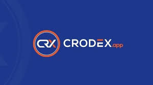
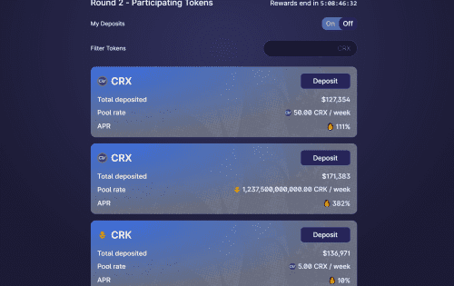

# Crodex

Crodex 是一个去中心化交易所 (DEX)，提供流动性并支持 Cronos 上的点对点交易。

# 我们开始吧：CRX Metaverse Hub 2.0 — 在 CROWD Launchpad 上的初始代币销售和启动

Metaverse Hub 2.0将在 Cronos 上开启以 NFT/Metaverse 为中心的 DeFi 体验新时代。这个扩展的元界中心的本币是 $MHUB 代币。$MHUB 将用于您在 Hub 所做的一切——您赚取的利润、您购买/出售的资产和文物、您将获得的参与门票等等。

# $MHUB 代币详情

- **与 $CRX 配对。
  **主要流动性将在 MHUB/CRX。
- **总共产生 9.5% 的销售费用。
  **每次卖出交易时，费用将自动领取并兑换为 $wCRO。
  — 2.5% 将由团队控制。最多 2% 将用于在 MHUB/CRX 对中形成额外的流动性。其余的将存放在国库中，用于开发、营销和合作费用。
  — 7% 将作为股息分享机制按比例分配给 $MHUB 持有者。股息份额的分配将是自动的（以 $wCRO 支付），但要求累积的股息需要由 $MHUB 持有人单独完成。
  股息分配机制的设计旨在将涉及 $MHUB 的交易所需的总 Gas 费用和滑点容忍度降至最低。
  LP代币的形成也会产生费用；因此，团队将寻求使用上述费用分配来保持流动性健康。此外，销售费用可以作为我们最近在整个加密货币市场上目睹的可能以空头期权为导向的价格操纵的安全防范。
  购买 $MHUB 代币不会产生任何费用。
