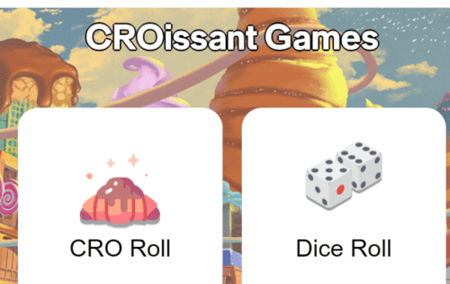
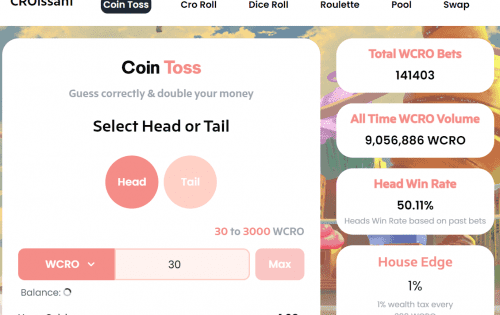

# Croissant games

与在黑匣子中运行的传统游戏不同，Croissant 游戏在公平、透明、非托管和不可变的智能合约上运行。 此外，我们有一个使用 EIP-712 的专有无 gas 模型，这意味着玩我们的任何游戏都不需要玩家支付任何 gas 费用！

## 为什么我们更好？

- **随处可用**——没有政府禁令，没有 KYC。

- **对任何人开放**——无需注册，您只需要一个加密钱包。

- **非托管**- 不需要存款，只有您可以随时使用您的资金。

- **即时支付**——在您下注后，会生成一个随机数，支付会自动发送到您的加密钱包。

- **开源**——我们的智能合约可以在 Cronos Explorer 上进行验证。

- **非通货膨胀**——我们的排放量每天减少 2%，并且我们有上限。

- **利润分配**——与其他项目不同，我们通过分红模式赋予代币价值，其中 50% 的房屋利润返还给用户。

  
