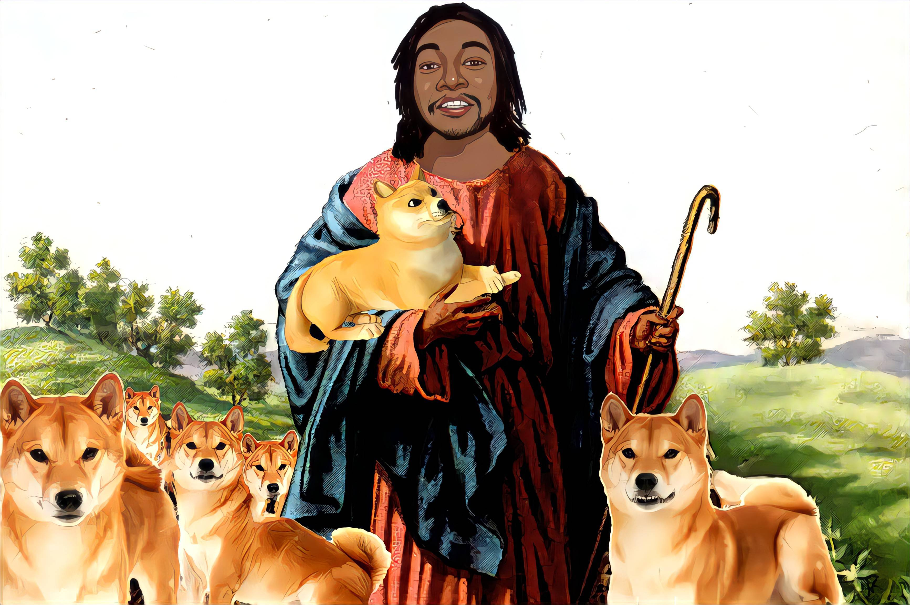

# CRYPTO MESSIAH

CRYPTO MESSIAH 的目标是团结所有 Crypto 用户，通过个人参与电动汽车的保护和采用以及减少汽油的使用来帮助减少环境破坏。全球植树量提高 72%，让政府参与这些活动，关爱海洋以及其他拯救地球的活动。加密弥赛亚也有重大发展。我们相信我们可以实现任何目标，对于弥赛亚来说，没有什么是不可能的。完成Cryptom Wallet Cryptomswap NFT Expection Integration Crypto Messiah Tower，Crypto Global Ascue Shiba Unity App 2D Pixel＆NBSP;视频游戏Game Crypto Messiah Ecogical Foundation Crypto Messiah Messiah奖学金总供应总供应：1,000,000,000,000,000,000,000,000 10％10％的税收公平我们需要将最强大的市场推动者带入 SHIB COMMUNITY

