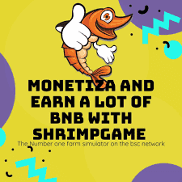

# Crypto Shrimp Game

CryptoShrimpGame 是网络币安智能链上排名第一的养虾模拟器和闲置游戏。你养的虾越多，它们下的蛋就越多。用你的蛋孵化更多的虾来增加你的产量。或将它们兑现为 BNB！

Crypto Shrimp Game 每天支付 5%，根据当前的挖矿效率。当你和其他玩家雇佣虾、复合收益和口袋 BNB 时，挖矿效率会上升和下降。

游戏的目标是比其他玩家更快、更频繁地雇佣更多的虾。这反过来又可以更快地为您赚取更多的 BNB。使用您的每日 BNB 收入雇用更多虾将在 20 天或更短的时间内将您的虾增加 3 倍。

