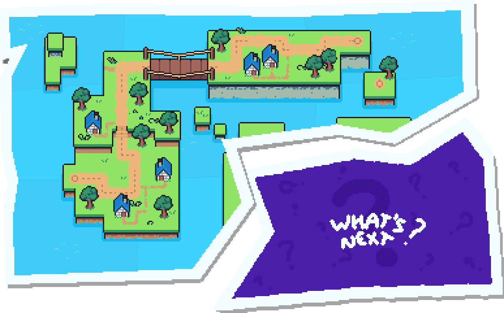

# CryptoFoxes

CryptoFoxes 是以太坊区块链上唯一使用老虎机铸造的 NFT。有 11,111 件待售。它们是我们系列的第二代。有关该系列的所有重要细节都在 CryptoFoxes 网站上。

所有资产都是手工制作的，然后 CryptoFoxes 使用 Python 脚本生成 48x48 GIF 并缩放到 480x480，并在以太坊区块链上的智能合约 ERC721 上铸造。每一个都是独一无二的，并以其属性精心制作。其中一些是超级罕见的！

