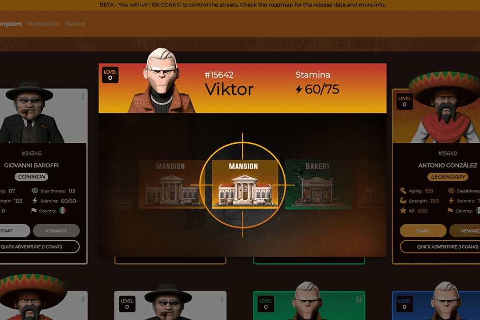

# CryptoGangsters

CryptoGangsters 是一款 NFT P2E（Play 2 Earn）游戏，灵感来自 GTA、The Crims、Hitman 和 Mafia 等黑帮游戏。您的角色（NFT）将能够通过多种途径登上 GangTown Metaverse 中最受通缉和最有影响力的名单。
游戏币是 CGANG 代币，托管在币安智能链 (BSC) 网络上。
要参与，您将需要一个加密货币钱包，例如元掩码，并打开盒子以接收独特的黑帮 (NFT)。 Gangsters有几种类型，属于世界著名的帮派，每个NFT还具有力量、敏捷和隐身等属性。之后，您可以开始在 GangTown 进行抢劫。但小心点！如果你被警察抓住，你可能会被拘留几天。立即在 GangTown 中征服、获胜和进化。

