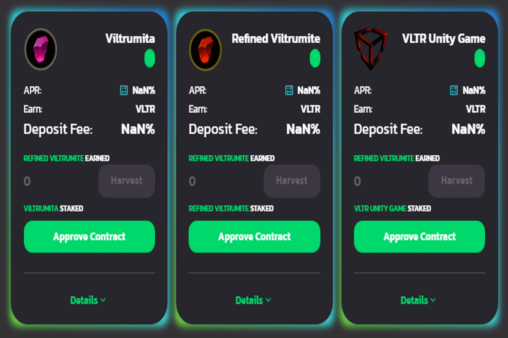

# CryptoMine Space X

CryptoMine Space X 是一款 NFT 科幻游戏，在此过程中享受玩耍和赚钱的乐趣。专为投资者和视频游戏用户设计。 Cryptomines Space X 旨在成为最好的区块链游戏，同时让其用户享受技能游戏的快感并赢得 $ Viltrumita。多链兼容 web3。

开采行星 如何开采行星 您必须聘请船员前往行星。你的工人和你的船的稀有性决定了你的力量和矿山的时间，这反过来又决定了你可以去哪些星球。例如，如果你有两个每个 MP 100 的工人和一艘 100 MP 的船，你可以去一个 300 MP 的 Lv3 星球。工人将能够根据他们想要收集 Viltrumita 的星球收集资源一次，因为每个星球都有自己的旅行时间，但它的船和工人拥有的星星越多，探险时间就越短。假设我以 300 Mp 去 Lv3 星球，探险持续 5 天。在时间结束之前，您将无法获得奖励，但请记住，您可以在探险期间每天玩 1 次小游戏来增加最终奖励。例如：为期 5 天的探险，奖励 200 Viltrumita。玩游戏您可以根据自己的技能获得额外的Viltrumite，专家玩家可以将奖励从200 Viltrumite增加到500 Viltrumite。奖励在行星上开采的资源给予玩家的奖励将根据玩家的技能进行调整，并且探险时间将根据船上的星星而减少。实现了一个由 3 种不同的预言机组成的系统来保持价值，即在进入游戏时，通过收购 Viltrumita 来购买工人、船只，并为其支付燃料、合同和汽油。提前取款费用 以 $ Viltrumita 领取奖励时，需要支付 22% 的提前取款费用，该费用将从您的第一次探险开始后每 24 小时减少 5%。

