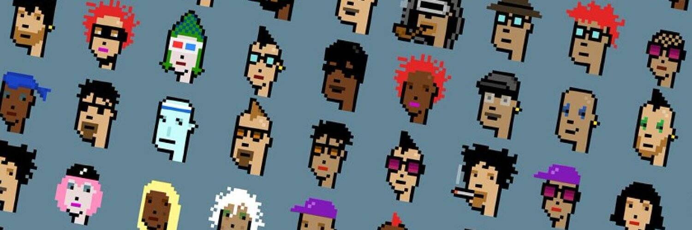

# CryptoPhunks

Not Larva Labs 现在是 CryptoPhunks 的官方主页。
我们创建了一个免版税的市场，用户最终可以轻松地买卖 CryptoPhunks。 CryptoPhunks 于 2021 年 6 月推出，已在三个不同的场合从 OpenSea 退市，是第一个收到来自 Larva Labs 的官方 DMCA 通知的 NFT 项目。
目前，我们正在目睹 web2 版权法单方面应用于 web3 世界，真正的去中心化和出处应该是最重要的。我们相信，如果我们愿意的话，我们有责任抵制审查并维护我们的言论自由。
所有的艺术都是衍生的。因此，所有艺术都应该是开源的，并且免费供所有人使用、重新混合和转换。为了实现真正的数字复兴，我们的创造力必须肆无忌惮和无限。
简而言之，我们的存在是为了颠覆和挑战旧范式的古老边界制造者，带来新思想、新艺术、新技术，开创一个新世界。

