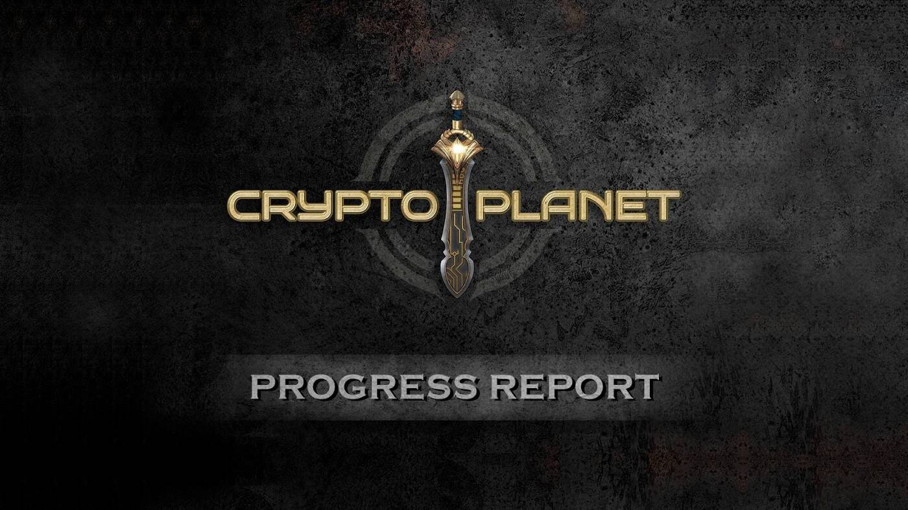

# CryptoPlanet

这一年是25001年：元素之战元年。在这场旷日持久的战争中，五个文明发现各自元素宝石的能量强度是由一根源自宇宙深处的特殊“弦”控制的。由于“弦”的不可预测性及其对战争的重要影响，它逐渐获得了一个神化的名字：先知。先知会在每个纪元中指定一颗元素宝石，这样它就可以获得更多的能量，让宝石的拥有者获胜一场短暂的战争。命运卡在影响战争中的宝石和文明的胜利或失败方面起着决定性的作用。

游戏玩法 - 前哨（第一阶段）：每场战争称为一个纪元。一个 epoch 将持续 86400 个区块（大约 3 天）。在一个纪元中，玩家将部署战舰保卫自己的星球，以获得守护者力量。如果该星球被先知宣布为获胜者，玩家将获得与他们拥有的守护者力量成比例的胜利分配。通过宝石兑换收取的 3.5% 税收中，0.5% 将用于回购。至于剩下的3%：15%将按照获胜者所拥有的守护神权比例分配35%用于回购获胜阵营的宝石；50%将在下一个纪元累积并加到税收中。等等。100% 公平游戏。玩来赚钱。由 BunnyPark 孵化，有安全审计。

