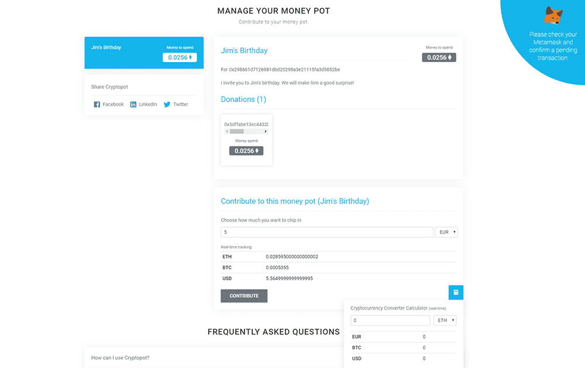

# CryptoPot

Cryptopot 是一个以太坊在线钱罐平台。安全地创建您的钱罐，邀请合作者并分享它。

CryptoPot 是一个基于以太坊的项目。 dApp 允许您创建钱罐。这些罐子将是私人的，只有您和您邀请的人才能访问。整个平台是去中心化的。它允许您以安全和私密的方式共享底池。

CryptoPot dApp 是基于以太坊协议的其他类别的加密资产。现在，根据用户数量，它在一般 dApp 排名中排名第 5473 位，在其他类别中排名第 566 位，这让您可以很好地了解 CryptoPot dApp 在其竞争对手中的表现。

通过分析最近 30 天窗口中的 CryptoPot dApp 数据，很明显 dApp 的余额为 12.71 美元，交易量稳定在 0.00 美元。 CryptoPot 在 30 天内产生了 0 笔交易，变化为 0%。显然，与之前的 7 天期间相比，交易量稳定了 0%。最近 7 天的数据显示，CryptoPot 用户基数为 0，并且稳定了 0%。

我们还建议查看 CryptoPot 活动概述和智能合约余额图表，以了解这些重要指标如何随时间波动和变化。

